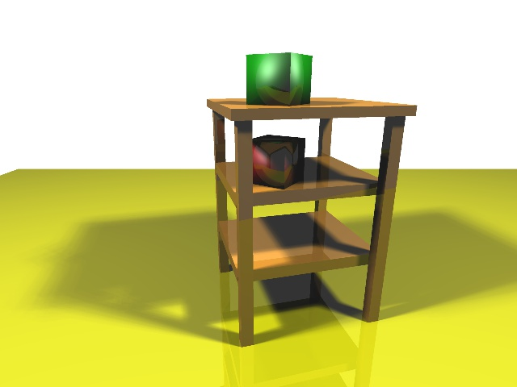
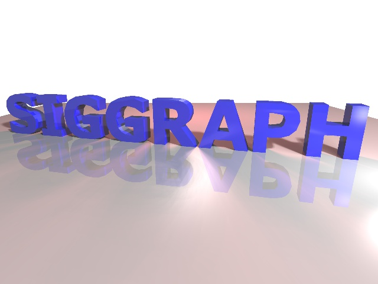

# assign1
## Overview
Assignment 1 from USC CSCI 420.

A height field viewer written in C/C++ and OpenGL. Can generate height field as point, wireframe or triangle based on the data from image, allowing the user to manipulate the height field in three dimensions by rotating, translating, or scaling it.

## Results

# assign2
## Overview
Assignment 2 from USC CSCI 420.

A roller coaster simulator written in C/C++ and OpenGL. Use Catmull-Rom splines along with OpenGL lighting and texture mapping to create a roller coaster simulation. Support loading .obj objects into the scene.

## Results

# assign3
## Overview
Assignment 3 from USC CSCI 420.

A ray tracer written in C/C++. Support basic Whitted-style ray tracing as well as recursive reflection, soft shadow and antialiasing. 

## Results

Table scene with antialiasing, soft shadow and recursive reflection features:

SIGGRAPH scene with antialiasing, soft shadow and recursive reflection: 
